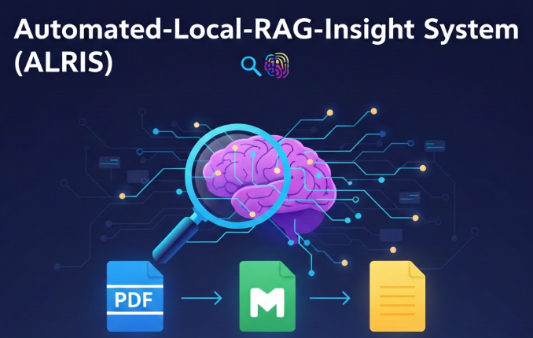

---

<p align="center">

</p>

# ArcticLoom ❄️🧠

**ArcticLoom v2.0** is a fully self-contained, advanced Retrieval-Augmented Generation (RAG) engine that runs entirely on your local machine. No cloud API keys required! It transforms your documents into a searchable intelligence hub using local AI models for embeddings and text generation.

Built with **Node.js**, **Express**, **Next.js 16**, and **Transformers.js**, this project offers a privacy-first, local-first approach to AI-driven document retrieval and analysis.

---

## 🚀 Key Features

* **Fully Local AI:** No API keys required! Runs embeddings and LLM inference locally using Transformers.js
* **Multi-Format Ingestion:** Processes PDF, DOCX, HTML, Markdown, TXT, CSV, and JSON files
* **Semantic Search:** Uses `all-MiniLM-L6-v2` embeddings for intelligent document retrieval
* **Local LLM:** `Llama-3.2-1B-Instruct` for natural language responses (auto-downloads on first use)
* **Smart Chunking:** Sentence-boundary-aware chunking with configurable overlap
* **Chat Interface:** Modern glass-morphism UI with conversation history
* **File Upload:** Drag & drop or click to upload documents
* **Document Management:** View, delete, and re-index documents
* **Source Citations:** See exactly which documents and passages were used
* **Streaming Responses:** Real-time token generation display
* **Privacy-First:** Everything runs locally - your data never leaves your machine

---

## 🌟 Real-World Use Cases

* **📚 Personal Knowledge "Brain":** For students and researchers managing hundreds of PDFs. Ask: *"What are the three main criticisms of the paper on Quantum Computing I saved last month?"*
* **📁 Instant Technical Documentation Assistant:** Point ALRIS at your GitHub repositories' `/docs` folders. Ask: *"How do I configure the authentication middleware in our internal API?"*
* **⚖️ Legal & Contract Analysis:** Drop lease agreements or contracts into the `/data` folder. Ask: *"What is the notice period for terminating this contract?"*
* **✍️ Content Creation Partner:** Maintain consistency in your creative work. Ask: *"How did I describe the protagonist's childhood in the first three chapters?"*

---

## 📐 Architecture & Pipeline

The system follows a standard RAG pipeline:

1. **Ingestion & ETL:** Local files are read and split into 2000-character chunks with a 200-character overlap to preserve context across boundaries.
2. **Embedding:** Chunks are vectorized using the **Snowflake Arctic M** model via the Hugging Face Inference API.
3. **Storage:** Vectors and metadata (fileName) are stored in a Weaviate "ALRIS_Documents" collection.
4. **Retrieval:** User queries are processed through a **Hybrid Search** that combines keyword matching and cosine similarity.
5. **Synthesis:** The top 6 relevant chunks are fed to **Llama-3.2-3B** to generate a natural language response.

---

## 📂 File Structure

```text
Automated-Local-RAG-Insight-System/
├── backend/                # Express/Node.js logic
│   ├── data/               # Source documents (.pdf, .md, .txt)
│   ├── src/
│   │   ├── index.js        # Express API (Hybrid search & Llama logic)
│   │   ├── ingest.js       # Ingestion & Chunking script
│   │   └── weaviateClient.js # Weaviate & HF Configuration
│   ├── .env                # Backend keys (WEAVIATE_API_KEY, HUGGINGFACE_API_KEY)
│   └── package.json
│
├── frontend/               # Next.js Application
│   ├── src/app/            # App Router (Next.js 15)
│   │   ├── layout.tsx      # Global styling & fonts
│   │   ├── page.tsx        # Modern Search UI with Lucide & Tailwind
│   │   └── globals.css     # Custom animations & Tailwind directives
│   ├── .env.local          # NEXT_PUBLIC_API_URL
│   └── package.json

```

---

## ⚙️ Installation & Setup

### 1. Prerequisites

* Node.js (v18+)
* That's it! No cloud accounts or API keys needed.

### 2. Clone and Install

```bash
git clone https://github.com/SaadxSalman/ArcticLoom.git
cd ArcticLoom

# Install Backend Dependencies
npm install

# Install Frontend Dependencies
cd frontend && npm install && cd ..

```

### 3. Environment Configuration

Create a `.env` file in the root directory:

```env
PORT=3002
DATA_DIR=./data
EMBEDDING_MODEL=Xenova/all-MiniLM-L6-v2
LLM_MODEL=Xenova/Llama-3.2-1B-Instruct
CHUNK_SIZE=1000
CHUNK_OVERLAP=200
TOP_K=5
```

Create `frontend/.env.local`:

```env
NEXT_PUBLIC_API_URL=http://localhost:3002
```

### 4. Run ArcticLoom

**Terminal 1 - Start Backend:**
```bash
npm start
```

**Terminal 2 - Start Frontend:**
```bash
cd frontend && npm run dev
```

### 5. First Run

On first run, the system will automatically download:
- **Embedding Model** (~80MB): `all-MiniLM-L6-v2` for semantic search
- **LLM Model** (~1.5GB): `Llama-3.2-1B-Instruct` for text generation

This may take a few minutes. After that, models are cached locally.

### 6. Usage

1. Open http://localhost:3000 in your browser
2. Upload documents using the Upload button or drag & drop
3. Ask questions about your documents
4. View source citations and relevance scores


---

## 🛠️ Tech Stack

| Layer | Technology |
| --- | --- |
| **Runtime** | Node.js |
| **Backend** | Express.js, Transformers.js |
| **Frontend** | Next.js 16 (React), Tailwind CSS, Lucide |
| **Storage** | JSON-based vector store (no native dependencies) |
| **Embeddings** | all-MiniLM-L6-v2 (local) |
| **LLM** | Llama-3.2-1B-Instruct (local, via Transformers.js) |
| **Parsing** | PDF, DOCX, HTML, Markdown, TXT, CSV, JSON |

---

Developed with ❤️ by **[Saad Salman](https://www.google.com/search?q=https://github.com/saadxsalman)**

---
